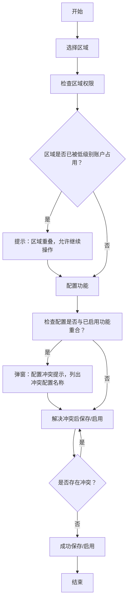

```mermaid
```mermaid  
graph TD  
A[开始] --> B[选择区域]  
B --> C[检查区域权限]  
C --> D{区域是否已被低级别账户占用？}  
D -->|是| E[提示：区域重叠，允许继续操作]  
E --> F[配置功能]  
D -->|否| F  
F --> G[检查配置是否与已启用功能重合？]  
G -->|是| H[弹窗：配置冲突提示，列出冲突配置名称]  
H --> I[解决冲突后保存/启用]  
G -->|否| I  
I --> J{是否存在冲突？}  
J -->|是| I  
J -->|否| K[成功保存/启用]  
K --> L[结束]

```